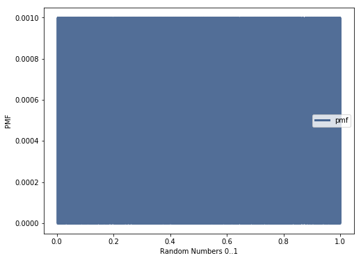
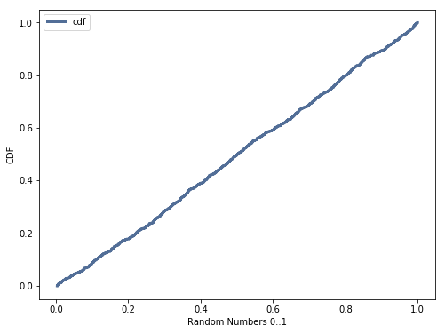

[Think Stats Chapter 4 Exercise 2](http://greenteapress.com/thinkstats2/html/thinkstats2005.html#toc41) (a random distribution)

>> **Conclusion:** PMF plots are not suited for large number of values because the noise obscures the fact most values have the same probability. However the CDF plot clearly shows the uniform distrbution.
>>
>> 
>>
>> 
>>
>> **Code:** [4-2-random_dist.ipynb](4-2-random_dist.ipynb)

