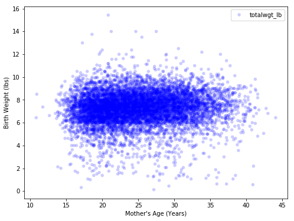
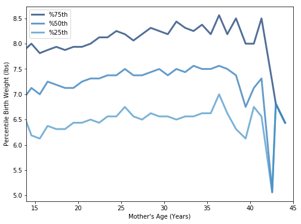

[Think Stats Chapter 7 Exercise 1](http://greenteapress.com/thinkstats2/html/thinkstats2008.html#toc70) (weight vs. age)

>> Scatter plot weight vs. age:  
>> 
>>
>> Percentile plot weight vs. age:
>> 
>>
>>`Pearson's=0.068834, Spearman's=0.094610`  
>>
>> **Conclusions:**
>>  1. There is little (linear) correlation between age and weight as shown by both the scatter plot and the correlation coeficients.  
>>  2. Spearman's correlation is greater than Pearson's due to some outliers.  
>>  3. The percentile plot shows a non-linear relationship with weight increasing more quickly till age 25, then slower till age 37 after which it moves to a decreasing relationship.  
>>
>> **Code:** [7-1-weight_vs_age.ipynb](7-1-weight_vs_age.ipynb)

