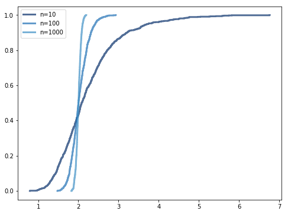

[Think Stats Chapter 8 Exercise 2](http://greenteapress.com/thinkstats2/html/thinkstats2009.html#toc77) (sampling distribution)

>>Sampling Distribution Estimate for various sample sizes:  
>>
>>
>>Standard Error and 90% confidence intervals for various sample sizes:  
>>```
>>               Stderr            Confidence Interval  
>>Sample Size                                           
>>10           0.864350  (1.29075739226, 3.8172459705)  
>>100          0.207680  (1.7116852503, 2.38757391051)  
>>1000         0.064909  (1.8946167797, 2.11013607849)  
>>```
>> **Conclusion:** As expected, the larger the size, the closer the estimate.  
>> **Code:** [8-2-sampling_dist.ipynb](8-2-sampling_dist.ipynb)
