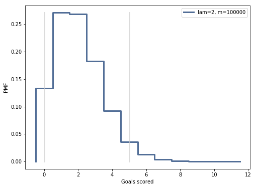

[Think Stats Chapter 8 Exercise 3](http://greenteapress.com/thinkstats2/html/thinkstats2009.html#toc77)

---

>> The distribution of estimates and 90% confidence interval for lam=2:
>> 
>> See [code](8-3-scoring.ipynb) for all plots.
>>
>> ```
>>                         Mean Error    Stderr 90% Confidence Interval
>>Goal Scoring Rate (lam)                                              
>>1                           0.00136  1.000440                  (0, 3)
>>2                           0.00831  1.415927                  (0, 5)
>>5                          -0.00245  2.227772                  (2, 9)
>>10                         -0.00521  3.159160                 (5, 15)
>>
>>Total Mean Error=0.002010
>> ```
>> **Conclusions:**  
>>  - the total mean error is small, hence the model can be considred unbiased
>>  - the model overestimates for small lambda and understimates for large lambda
>>
>> **Code:** [8-3-scoring.ipynb](8-3-scoring.ipynb)
---